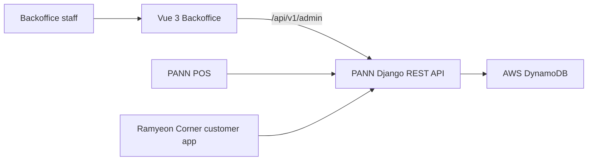

# PANN Backoffice

Centralized retail-operations dashboard for the PANN Ramyeon Corner capstone system. The Backoffice gives authorized staff one place to manage accounts, customers, products, categories, suppliers, promotions, operational notifications, audit logs, and sales reporting.

[Live application](https://admin.ramyeoncorner.com/login) · [Customer application](https://github.com/PANNRamyeon/Ramyeon-Customer) · [POS application](https://github.com/PANNRamyeon/Ramyeon-POS) · [Shared backend](https://github.com/PANNRamyeon/Ramyeon-Backend)

## Project status

This is a team-built client capstone. The current `main` branch is a deployable Vue frontend connected to the shared PANN backend. Development is presently paused by the client, so the repository should be read as a deployment candidate rather than an actively maintained commercial service.

The previous root README described an older combined POS/Django/MongoDB setup and included outdated instructions. A sanitized copy is retained in [`docs/legacy/README.md`](docs/legacy/README.md).

## What the application covers

- Staff authentication, password recovery, profiles, and role-aware navigation
- Account and customer administration
- Product, category, subcategory, stock, batch, and bulk-entry workflows
- Supplier records, purchasing, shipment receipt, and order history
- Promotions management
- Sales-by-item and sales-by-category reporting
- Dashboard KPIs and Chart.js visualizations
- Operational notifications, logs, pagination, searching, and filtering
- Responsive light and dark interface

## System context



This repository contains the administrative frontend. The API and shared data services live in [PANNRamyeon/Ramyeon-Backend](https://github.com/PANNRamyeon/Ramyeon-Backend).

## Technology stack

| Area | Technology |
|---|---|
| Framework | Vue 3.5, Vite 6 |
| Routing and state | Vue Router 4, Pinia 3 |
| API client | Axios |
| UI | Bootstrap 5, custom CSS, Lucide Vue |
| Reporting | Chart.js, Vue Chart.js, jsPDF |
| Testing | Vitest, Vue Test Utils, jsdom |
| Deployment | Netlify-compatible static build |

## Repository structure

```text
src/
├── components/       Reusable UI and domain components
├── composables/      API, authentication, data, and UI logic
├── layouts/          Authenticated application shells
├── pages/            Accounts, inventory, reports, suppliers, and more
├── router/           Routes and access-aware navigation
└── services/         Backoffice API clients
```

## Local setup

### Prerequisites

- Node.js 18 or newer
- npm
- A running instance of the [shared backend](https://github.com/PANNRamyeon/Ramyeon-Backend)

### Install and configure

```bash
git clone https://github.com/PANNRamyeon/Ramyeon-Backoffice.git
cd Ramyeon-Backoffice
npm ci
```

Create `.env.local` with a non-secret frontend API URL:

```dotenv
VITE_API_URL=http://localhost:8000/api/v1/admin
```

Never place database credentials, AWS secrets, JWT secrets, or private payment keys in a `VITE_` variable. Vite exposes those values to the browser bundle.

Start the development server:

```bash
npm run dev
```

## Available commands

| Command | Purpose |
|---|---|
| `npm run dev` | Start the Vite development server |
| `npm run build` | Create a production build in `dist/` |
| `npm run preview` | Preview the production build locally |
| `npm run test:unit -- --run` | Run Vitest once |
| `npx eslint .` | Check the code without applying automatic fixes |
| `npm run format` | Format files under `src/` |

## Testing and validation

Vitest and Vue Test Utils are configured, but the current automated suite contains only the original scaffold component test. The capstone's broader black-box and user-acceptance evidence was maintained outside this repository and should not be presented as automated coverage.

Recommended next steps are route-level component tests, mocked API-contract tests, accessibility checks, and browser end-to-end coverage for authentication, inventory, suppliers, promotions, and reports.

## Deployment

`netlify.toml` builds the application with Node 18, publishes `dist/`, applies SPA fallback routing, and sets basic security and cache headers. Configure `VITE_API_URL` in the hosting environment before deployment.

## Known limitations

- The frontend depends on a separately deployed API and its current contract.
- Automated frontend coverage is minimal.
- Some Vue starter/demo files and debug routes remain in the current branch.
- Production authorization and data protection depend on the shared backend configuration.
- Historical MongoDB instructions are retained only in the sanitized legacy document.

## Related repositories

- [PANN Backoffice](https://github.com/PANNRamyeon/Ramyeon-Backoffice) — staff administration and reporting
- [PANN POS](https://github.com/PANNRamyeon/Ramyeon-POS) — cashier, checkout, shifts, and offline workflows
- [Ramyeon Customer](https://github.com/PANNRamyeon/Ramyeon-Customer) — customer ordering and loyalty experience
- [PANN Backend](https://github.com/PANNRamyeon/Ramyeon-Backend) — shared Django API and DynamoDB services

## License

No standalone license file is present on the current `main` branch. Repository visibility does not by itself grant permission to copy, modify, redistribute, or commercially reuse the project.
